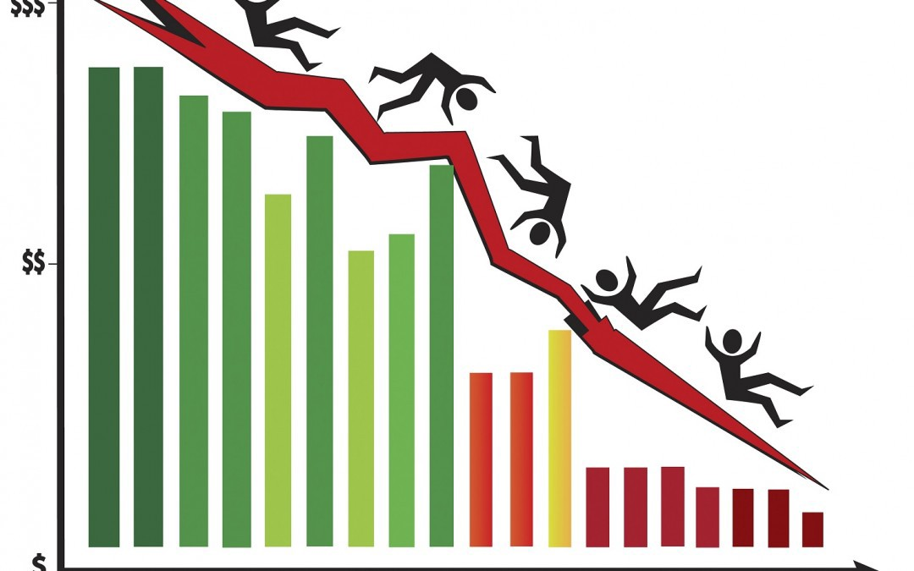

## Case Studies in Pandas (Finance focus)

November 2018

Going into generating a report on The Great Recession

### **Looking Back: A decade after the Great Recession?**

Recession is defined by the [National Bureau of Economic Research](http://www.nber.org/) (NBER)  as "a significant decline in economic activity spread across the economy, lasting more than a few months, normally visible in real gross domestic product (GDP), real income, employment, industrial production and wholesale-retail sales."
     

According to NBER (the official arbiter of  U.S. recessions), there were [10 recessions](http://www.nber.org/cycles/) between 1948 and 2018. The most recent recession began in December 2007 and ended in June 2009, many of the statistics that describe the U.S. economy have yet to return to their pre-recession values.

#### Chapter 1 - Where is all the data? A review of previous pandas courses.

- Lesson 1.1 - Getting all the data in the same places
  - Learning objective: Importing several data frames into one platform using functions `pd.read_csv`, `pd.read_excel`
- Lesson 1.2 - Manipulating multiple data frames
  - Learning objective: Clean & merge several data frames based on different conditions (`stack`, `pivot`, `merge`, `pd.concat`, `join`)
- Lesson 1.3 - EDA (statistical and graphical methods)
  - Learning objective: Getting some basic summary statistic information from the imported data (proper pandas indexing `.loc`/`.iloc`, `.apply`, `.map`)

#### Chapter 2 - How bad was The Great Recession?

Showing the students to create different types of plots highlighting how bad the Great Recession was.  

- Lesson 2.1 - Unemployment rates among States
  - A learning objective: Learning to use matplotlib to plot unemployment rate on the US map.
- Lesson 2.2 - Unemployment rates around the world
  - A learning objective: Practicing `filter` function to compare US unemployment rates with 3 other countries of student's interest.
- Lesson 2.3 - Consequences on different industries
  - A learning objective: Learning to create a grouped bar chart to compare different industries in different periods (`groupby`, pandas plot)
- Lesson 2.4 - Establishment Births and Deaths ### NEED TO CLEAR THIS UP ###
  - A learning objective: Creating area plot represent birth and death rate before and after the recession.

#### Chapter 3 - The laser focus - Creating your own version of this analysis

Thinking of narrowing the story but don't know what to do. Thinking of showing the student how to calculate some statistical number/ financial criteria/ doing data engineering.

- Lesson 3.1 -  Looking at stock price by segment, over this period. Select a particular stock.
  - A learning objective: Learning how to work with time series dataset and create a stock price chart.
- Lesson 3.2 - Fundamental analysis, perform a DCF analysis based on past 5y financials
  - A learning objective: Learning how to construct a function to calculate DCF (could compare 'theoretical value' with the actual value due to recession)
- Lesson 3.3 - Feature engineering?
  - A learning objective: Learning about MACD and STO technical indicators
- Lesson 3.4 - Comparing these strategies: Technical vs. Fundamental valuation.
  - A learning objective: Generalizing the use of function for several company using `.apply` for the whole data frame

#### Chapter 4 - The consequences and how it changed America's economy

Thinking of teaching students to maybe automate the whole process by creating pipeline? Or maybe predicting/ creating alert of recession?
Think maybe focusing on developing a report about the fundamental economic data would be good here. As you mentioned, recreating the BLS' report could be a start, could make comparisons between data in 2008 and today. Need to be careful about doing too much in the time you have available. You want the lesson to be one coherent story.

- Lesson 4.1 - PDF reports with pandas, jinja, reports packages. (ideally, you'd use jupyter though).
  - A learning objective: Learn how to generate PDF with pandas
- Lesson 4.2 -
  - A learning objective:
- Lesson 4.3 - Putting it All Together
  - A learning objective:

References:

[Report from The Washington Post](https://www.washingtonpost.com/graphics/2018/business/great-recession-10-years-out/?noredirect=on&utm_term=.28f090cdbafd)

[Report from Bureau of Labour Statistic](https://www.bls.gov/spotlight/2012/recession)

[Plot matplotlib with basemap](https://stackoverflow.com/questions/39742305/how-to-use-basemap-python-to-plot-us-with-50-states)
