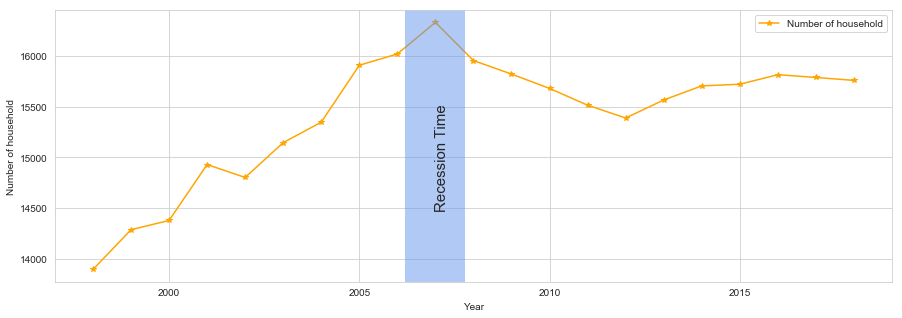

# Case Studies in Pandas (Finance focus) 

This is meant to be a practical application of the material learned in our pandas courses.  We'd love to showcase your real-world experience in Finance in this hands-on course.  Please include how to automate Business Reporting with Python.

Skills to practice:

- Import and export df
- EDA: statistical and graphic report
- Pivoting, melting, visualizing 
- Merge, join and combine data frames
- Organize, reshape and aggregate multiple datasets

## Step 1: Brainstorming


In order to have a clear idea of what you will teach in your course, we ask that you answer the following questions. 

### What problem(s) will students learn how to solve? 

Produce a Financial Report from multiple  data sources

### What techniques or concepts will students learn? 

In this course, the students will learn to applied all the skills they have learned from previous pandas courses (import, export, explanatory data analysis, manipulate multiple datasets, etc.)

### What technologies, packages, or functions will students use? 

pandas, matplotlib, seaborn, missingno, 


## Step 2: Choose the audience

*Unaware Umberto:* Umberto's degree gave him an excellent grounding in economic theory, but the only quantitative work he did was with very small data sets using Excel and a little bit of copy-and-paste SPSS. The managers he worked with so far in his projects used more complex spreadsheets and some software packages developed in house; he hasn't yet had much exposure to R, Python, SQL, or other stars in the data science constellation, and is only vaguely aware of how they could help him. However, Umberto is constantly looking for easier and more efficient ways of doing his job tasks-at-hand to move up in his demanding career.

*Starting Sindhu:* Sindhu came out of university with expert-level knowledge of immunology, but only knows basic statistical concepts and techniques. However, needing to visualise a lot of her findings, Sindhu quickly found that nor Excel and JMP - the tools used in her team - nor SPSS - the software used in university - were as customizable as she would have liked. Moreover, she lost a lot of time building her model from scratch each time. A quick survey among research scientist friends led her to R and DataCamp. After two free courses and the relief that it was actually doable, Sindhu subscribed.

*Coder Chen:* Chen is responsible for a group of 30 programmers developing software for next-generation farm machinery. Her team is now responsible for developing applications that will help customers analyze and understand the large volumes of data being collected by sensors placed in the field and on their equipment.

*Mathematical Marta:* Marta is very comfortable with mathematical abstractions, and is able to make sense of abstruse theory quickly and easily, but even the one stats course she did eight years ago was theoretically oriented. She is aware that real-world data is sometimes messy, but hasn't had to deal with that messiness herself.

*Advanced Alex:* Having touched the basics of data science in his education, Alex is currently using Python in his job. To get better and improve his business' competitive edge, he went looking for more Python skills. Google and forums led him to try edX and DataCamp. DataCamp's renowned instructors and the fact that respected institutions use it pulled Alex in. Today, he uses DataCamp as his first foundational resource and supplements it with specific, more in depth courses on Coursera. 


## Step 3: Course Outline

Each DataCamp course typically has about the same amount of content as a half-day conference workshop (about 4 hours), and contains 4 chapters, 15 lessons, and approximately 44-60 exercises (including videos).

A typical breakdown is:

Chapter 1 has 3 lessons. This chapter is shorter than the rest since it serves as an introduction to the topic.
Chapter 2 has 4 lessons.
Chapter 3 has 4 lessons.
Chapter 4 has 4 lessons.

Each lesson is comprised of:

\- a video lesson with slides and script presenting a topic, concept, or learning outcome
\- 2-4 exercises that allow learners to apply what you've presented in the preceding video

Please refer to the sample outline here for reference:  [https://github.com/datacamp/sample-outline](https://www.google.com/url?q=https://github.com/datacamp/sample-outline&sa=D&ust=1543198121706000&usg=AFQjCNE9xD48xAufulphnCfFggfG69rwKw)

Please  submit a complete course outline. Please provide the title of each  chapter, the title of each lesson, and a brief description of each  lesson's contents including a learning objective for each lesson. 

**Looking Back: A decade after the Great Recession?**


#### Chapter 1 - Where is all the data? A review of previous pandas courses.

- Lesson 1.1 - Getting all the data in the same places
  - Learning objective: Importing several data frames into one platform using functions `pd.read_csv`, `pd.read_excel`
- Lesson 1.2 - Manipulating multiple data frames
  - Learning objective: Clean & merge several data frames based on different conditions (`stack`, `pivot`, `merge`, `pd.concat`, `join`)
- Lesson 1.3 - EDA (statistical and graphical methods)
  - Learning objective: Getting some basic summary statistic information from the imported data (proper pandas indexing `.loc`/`.iloc`, `.apply`, `.map`)

#### Chapter 2 - How bad was The Great Recession?

Showing the students to create different types of plots highlighting how bad the Great Recession was.  

- Lesson 2.1 - Unemployment rates among States
  - A learning objective: Learning to use matplotlib to plot unemployment rate on the US map.
- Lesson 2.2 - Unemployment rates around the world
  - A learning objective: Practicing `filter` function to compare US unemployment rates with 3 other countries of student's interest.
- Lesson 2.3 - Consequences on different industries
  - A learning objective: Learning to create a grouped bar chart to compare different industries in different periods (`groupby`, pandas plot)
- Lesson 2.4 - Establishment Births and Deaths Rate
  - A learning objective: Creating area plot represent birth and death rate before and after the recession.

#### Chapter 3 - The laser focus - Creating your own version of this analysis

Thinking of narrowing the story but don't know what to do. Thinking of showing the student how to calculate some statistical number/ financial criteria/ doing data engineering.

- Lesson 3.1 -  Looking at stock price by segment, over this period. Select a particular stock.
  - A learning objective: Learning how to work with time series dataset and create a stock price chart.
- Lesson 3.2 - Fundamental analysis, perform a DCF analysis based on past 5y financials
  - A learning objective: Learning how to construct a function to calculate DCF (could compare 'theoretical value' with the actual value due to recession)
- Lesson 3.3 - Feature engineering?
  - A learning objective: Learning about MACD and STO technical indicators
- Lesson 3.4 - Comparing these strategies: Technical vs. Fundamental valuation.
  - A learning objective: Generalizing the use of function for several company using `.apply` for the whole data frame

#### Chapter 4 - The consequences and how it changed America's economy

- Lesson 4.1 - It took nearly a decade for America to get back they were before TGR

  - A learning objective:  Plotting median income before and 10 years after TGR. (learning to save plot as image file for report)

  Lesson 4.2 - Homeownership 10 years before and after TGR

  - A learning objective: Creating pivot table using homeownership data (2 methods using `groupby` or `pd.pivot_table`)

- Lesson 4.3 - Putting them all together: Young people are more reluctant to own a house

  - A learning objective: Creating a trend line based on the data

## Step 4: Final Chapter Exercise

The best way to make the goals in Step 1 firmer is to write a full description of an exercise that students will be able to do toward the end of the course. Writing exercises early is directly analogous to test-driven development: rather than working forward from a (probably ambiguous) set of learning objectives, curriculum designers work backward from concrete examples of where their students are going. Doing this also helps uncover technical requirements that might otherwise not be found until uncomfortably late in the lesson development process. 

Please include the course's capstone exercise with the corresponding code. You may want to refer to exercises in a live DataCamp course for reference or see the example below.

Sample Python Final Exercise


Please  submit your course's final exercise below. You must include context  (the text above the instructions), 4 or fewer precise instructions, and  the solution code learners will need to execute your course's final  exercise to show how far learners are likely to get by the end of your  course. Check the screenshot above for an example. Note that no more  than 15 lines of code should be provided for the exercise.

#### Exercise

```python
## Step 1: Setting the index
new_df.index= __._____(__.__)

## Step2: Plotting the trend line
fig, ax = plt.subplots(figsize=(15,5))
new_df[__[__] == ___].plot(style='*-', color='orange', ax=ax)
ax.axvline(37, color='cornflowerblue', lw=60, alpha=0.5)
plt.text(37, 15000, "Recession Time", rotation=90, verticalalignment='center', fontsize=15)
plt.title(___)
plt.ylabel(___)
plt.xlabel(___);
```

#### Result:



#### Instructions

Creating a trend line for number of household owned by people under 25 during the 20 years period from 1998 to 2018. 

- To plot timeseries, set index of the data frame as the Year column. (Remember to turn the column into date time object by wrapping the whole column inside pandas `to_datetime` function)
- To plot the trend line for young adult only, filter `Age range` column to get only young adult (under 30). 
- Then plotting a shaded bloc from 2006 to 2008, around recession time. This part has been done for you.
- Every plot will need a valid title and label for its x axis and y axis.
  - Use: 'Number of household with homeowner under 25 year old' for the title 
  - 'Number of household' and 'Year' for y and x axis

#### Solution code

```Python
new_df.index= pd.to_datetime(new_df.Year)
fig, ax = plt.subplots(figsize=(15,5))
new_df[new_df['Age range']=='Young adult (under 30)'].plot(style='*-', color='orange', ax=ax)
ax.axvline(37, color='cornflowerblue', lw=60, alpha=0.5)
plt.text(37, 15000, "Recession Time", rotation=90, verticalalignment='center', fontsize=15)
plt.title('Number of household with homeowner under 25 year old')
plt.ylabel('Number of household')
plt.xlabel('Year');
```

